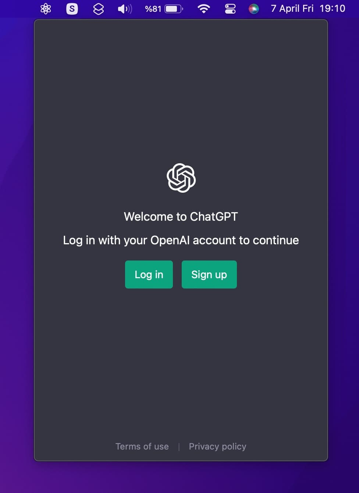

# MGPT - ChatGPT MenubarApp

MGPT is a simple MenubarApp for macOS that allows you to easily access ChatGPT. With just a few clicks, you can have ChatGPT up and running on WebView.

MGPT is only enables you to use ChatGPT easily through a web browser and does not provide any additional functionality.

## Usage
1. Download Latest version [v1.0](https://github.com/yakupseymen/MGPT/releases/download/v1.0/MGPT.zip) - <em>require MacOS 13.0 or newer</em>
2. Open the application (If you want move to the Applications folder).
3. Click MGPT icon on the Menubar to use it.
4. You can use the <code>cmd+q</code> combination to close the application.
